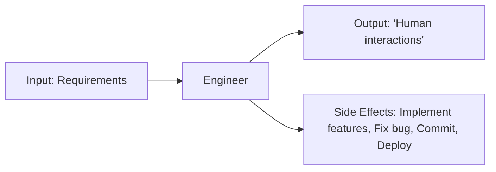
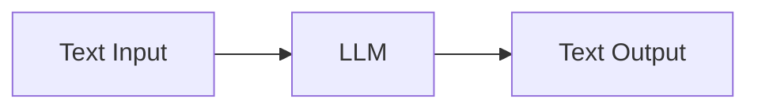
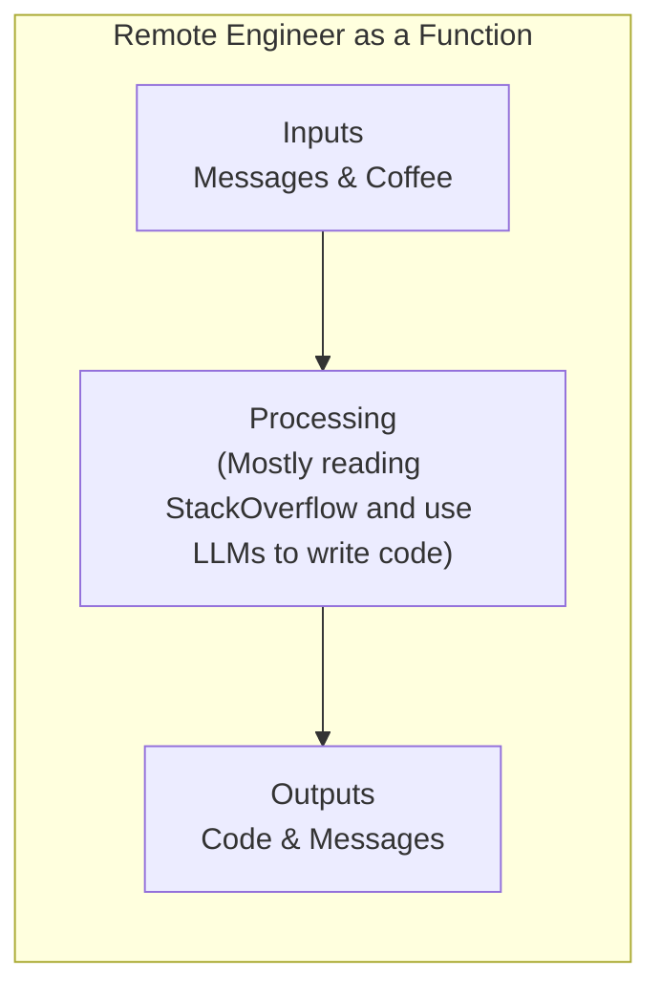
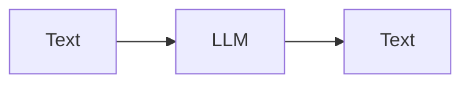
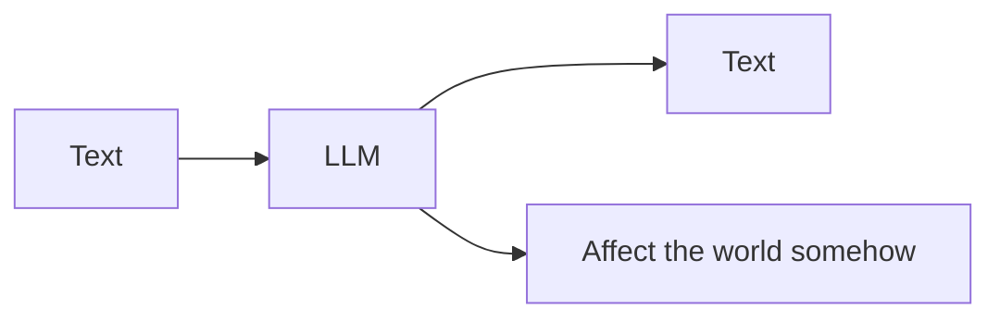
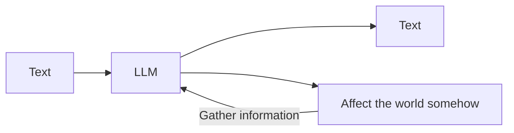
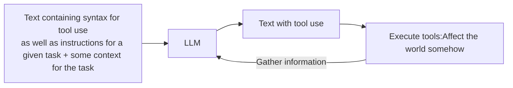

# A step by step guide to implement AGI (Productivity explosion: part 2)
Alternative meme titles:
### *"Thinking of it as a function" is all you need.*
### *LangChain considered harmful*
### *Getting my agents to create agents for fun an profit*

## Foreword
You read that right, and I'm damn serious.

I believe I can walk you through an argument for what AGI will be, as well as a step-by-step guide on how to implement it.

That's the point I want to make, and it's not a point I can make with a short post.

This post will therefore be quite long, so I decided to format it, add titles...

**I'll put the key points in bold, so you can skim through**
I'll title all the parts clearly so you can skip the parts you don't care about.

## This post goal and structure

**Goal**: I'd want to be full time on fiddling with agentic, because I'm somehow good at it.  I want to share my work, discuss it with people. I'm launching a Discord server, where I'll share **ALL** my work. Past, present and future. I'd also do a few video calls each week to share my advancements, review code, discuss everyone's ideas.

**I won't lie: if you like this post, and decide to share it on Youtube/tXitter/MSN Meessenger, that would be greatly appreciated. It would genuinely help me.**

**Structure**
I'll make title part independent of each other.
I'll do my best for each part to be understandable even if you read it first (and mostly, even if you're new to code).

## About me

I'm diagnosed as smart (Not to brag, but my IQ has three digits), but also as autistic with severe ADHD.

I have to take the largest Ritalin legal dose to be able to do the things I don't really want to do.

I'm addicted to Kratom because Ritalin is not enough. I'd like to quit. 

I have dissociative identity disorder. (About that, I wouldn't take offense if you don't believe that’s real. In full transparency, I'm not that sure I believe most of the people who say they have it.) I won't extend more on that (unless you're curious—I'd be, feel free to interact), except to say that I sometimes lose 6 hours straight of my life, and code has been written. I'm all for clean code, I know all the principles of clean code, I'm big on TDD. But some part of me (named Anakin) doesn't really give a crap. That part of me does agentic.

Also, I've been told that my writing style is unbearable because I get myself stuck into verbal diarrhea no one asked for (In French, it's called a "tunnel"). Sorry, I try my best to be to the point. (I'm kind of a reverse Turing test; sometimes you can't really tell I'm not an LLM in a suit.)

**TL;DR**

**I have cool ideas, but my code can be messy, lazy, and I write a lot of words.**

## The situation I'm in

So, here I am, I believe I have cool ideas to share about agents but I'm a prisoner to my mental health. 

I'm working for a great company, but I'm barely able to do my job. 
I'm pretty sure I could be hired somewhere based on my ideas about agentic. I'm also pretty sure my person would get me fired in a short amount of time.


## What I'm about to do/What is the best that could happen in my life after this Reddit post

Following [my previous post]\([https://www.reddit.com/r/AI\_Agents/comments/1gsqt1v/im\_close\_to\_a\_productivity\_explosion/](https://www.reddit.com/r/AI_Agents/comments/1gsqt1v/im_close_to_a_productivity_explosion/)) I was asked a bunch of time where my stuff could be found.

I’ve decided to open my workspace and make it all accessible to those who want to delve deeper. The first step is a dedicated Discord server where I’ll share every piece of my work—architectural diagrams, code snippets, workflows, experimental projects, and more. It will be a place for open collaboration, where you can ask questions, propose solutions, and interact with both me and other enthusiasts in real-time. I’ll also schedule periodic voice calls to walk through code, brainstorm new ideas, and host Q&A sessions.

The idea is to cultivate a ‘research lab’ atmosphere. This isn’t just about dropping code into a repository—it’s about dynamic, interactive learning. I’ll upload versioned prototypes, annotate key logic blocks, and track the evolution of my agentic frameworks over time. We’ll hold workshops on specific topics, such as implementing recursive self-improvement loops, integrating external APIs efficiently, or establishing stable coding conventions for agents. You’ll gain a front-row seat to my entire pipeline: I’ll show rough drafts, intermediate experiments, and polished releases, all while inviting feedback, suggestions, and fresh angles from the community. Together, we can refine these ideas into robust, cutting-edge systems.


## The claims

### I can define AGI and explain the steps to reach it

I can explain what AGI is, and tell you all the steps to build it.

For the sake of the argument, I'll define AGI as "a competent software engineer." I have two reasons for that:

1. I'm a software engineer. I could automate a lot of jobs if given infinite time (not specifically me—I mean in general, "a software engineer" + "infinite time" = "automating a lot of stuff").
2. Agents are made of code. A competent coder made of agents can work on itself.

### Recursive self improvement goes \*click\*. You won't see it before it happens

Think of it as standing at the edge of a complexity cliff. 
At first, agents may exhibit modest, steady improvements—fine-tuning code efficiency here, refining a prompt there. 

But as these enhancements accumulate, they reach a certain point where the agent’s ability to re-engineer its own methods—its code, logic, and approach—becomes robust and far-reaching. 


### There is room for recursive self improvement with agentic alone

#TODO: 


## The intuition

### Foreword

When I'll say **AGI**, I'll mean **A competent software engineer**.
We can argue on that definition, but my point is: "that's what I'll mean when I'll use the term AGI from that point forward". If your definition of AGI differs, what I'll say may not apply, so keep that in mind.


#### Think of it as a function

A heuristic I'll use a lot is **Think of it as a function**.

(Note: `function` as in `a python function` as opposed to stricter definition you'd find in Functional Programming: `maps an output space to an input space`

You can frame everything as a function: 
Even me.
I work as developer, I receive inputs (project details, tickets, credentials), produce outputs (interactions) and cause side effects—Like feature being implemented.

**Human Engineer:**  


A large language model is a simpler function: it takes text as input and returns text as output. That’s it—no direct side effects in the real world.

**LLM:**  

<marquee>a<marquee>a</marquee></marquee>

**If we want to define what AGI will be, we should ask "How do we expect it to behave as a function".**

**Once we have AGI, what do we expect as `outputs` and `effects on the world` for a given `input` ?**

### It was always going to be Next Token Prediction

I need to take this tangent, because what I'll propose next builds on it.

I believe there is a logical necessity (stuff that couldn't be otherwise) in "Next Chunk Prediction" (NCP) as a path towards AGI.

If it produce language, how would it do that otherwise than "one chunk after another".
If AGI is an entity that produces code, what could it possibly look like **As A Function** ? Tell me in comments if you can think of a way, a function would produce language (including code) in any other way that "predicting the next chunk recursively"

I think we're in a "boiling frog" situation with LLMs, they are parts of reality now, and we don't even talk about them at the dinner table anymore.

#### We may not understand what's currently happening

My point is: **If LLMs are the path to AGI, we could be blind to that, because we're used to their existence, and none of us can really grasp the implications yet** Evolution probably didn't make us capable of having an intuition about what's happening right now. (Let alone what's going to happen.)

#### It was always the path we'd take

If you asked 30 years ago, the Turing test was widely accepted as the gold standard to determine whether or not a synthetic entity could be deemed "intelligent." (Does it still apply in a world where people know LLMs are a thing?)

In other words, **an entity capable of producing language given language.** As a function, it takes human language as input and returns human language.

Isn't the most natural way to that, picking on "chunk" at a time? (I'm not saying it's the only way—text diffusion is a thing. What I'm saying is that it's the most straightforward way.) The obvious control flow for that is:

```python
from skynet import gimme_next_chunk

def ask_AGI(input: str) -> str:
    message = (f"user:{input}"
               "\nassistant:")

    while True:
        next_chunk = gimme_next_chunk(message)
        if next_chunk == "<!STOP!>":
            return message
        
        message += next_chunk
```

**Should you have a time machine that can go anywhere in time between**: The formulation of the Turing test (I think it was by Isaac Newton) and, say, 2005.

Use this time machine to kidnap a bunch of brilliant minds at various point of that interval (for instance, 2005 Ilya Sutskever, not Elon Musk, Alan Turing, not Elon Musk, 1995 Geoffrey Hinton...), put them in a room, and add digital display with a countdown for dramatic effect. 

Ask them to specify AGI as a function, it's not unthinkable that they would have come to something close to the control flow the code above illustrates.

**TL;DR**
**Next Token Prediction is a step to AGI because picking a chunk given all the previous as an input is kind of the only way**

### What are we aiming for anyway ?

So, at one point humanity **WILL** reach AGI, regardless of how you define this term.


So let me ask again: **Once we have AGI, what do we expect as `outputs` and `effects on the world` for a given `input` ?**


If we assume: **AGI** == `a competent software engineer`, We can take that as a starting point to specify how a human software engineer should behave as a function:
**If you hire me as a software engineer working remotely, what behaviors would you expect from me as a function**

#### Me, software engineer, as a function
I:
- Takes inputs (Discord messages, mails, coffee☕)
    - Messages containing requirements, workflows, credentials...
- Affect states (update the code, deploy, fix bugs)
- Produces outputs
    - Report on what I've done 
    - Ask questions
    - Create Pull Requests
    - Say: "I don't get it, it works on my machine"



Should we formalize a software engineer as a function, it would look like:

```python
from reality import some_dude

print(
    some_dude("""Hello, Monica-Chang Von NGuyensky.
We're glad to have you on board.

I sent you your credentials in a mail. 
From now on, you'll be assigned Jira tickets to work on our project.
You can find processes, conventions, workflows (like how to use Jira and stuff) here: https://somecompany.ext/wiki .

Welcome to SomeCompany, world leader in "Some Service", expert in `Stuff` since some year in the past 🙂."""
    )
) # > Hi !
```

**☝️ So, if you have an AGI replacing a competent software engineer, and should it automate our jobs, that's more or less how you could expect to use it.**

(In practice, I guess the interaction could be done either on Discord or with voice input, but a mere software layer on top of that function could achieve that.)

### It can't not be agentic

#### Well, it could be, but agentic will be the first form of it
I guess at one point in time, AGI will be an embodied entity, with audio and video as input modalities, and as output, all the muscular activation to type on a keyboard (what Gary Marcus would call "a wall"). So technically, it **CAN** not be agentic, and surely, **at some point it won't be.**


#### That's the shortest path to it

In the same way Next Token Prediction is a step to AGI, what would that look like *as a function* ?

The control fow of using a LLM like a chatbot, *as a function* would look like:


Could you argue for anything else as a following state than:

?


then:



To go further, with as starting point:
- Assuming `LLM` as a function is a `text`=>`text` black box.
- Given an arbitrarily competent LLM.
- The goal is: automate the job of a software engineer using this black box (So have it to write code/perform all the actions surrounding coding)

What else but agents ?

Could you think of any control flow other than:


Two things about that:
- It seems like the obvious step forward
- It's kind of the definition of agentic

### It can't not be **Swarm/Micro-Agentic**; it can't not be **Agents as code**. Also, here's my work on it

**Foreword**: 
This point is probably the less obvious one, so I decided to try and make it by talking about my work, using some of my actual code. I'll progressively present you with some of my tools and what they do.

First, thinking of each agent *As A Function* is useful, but being able to use them as functions is also really sweet.

**Here's how I interact with agents in Python:**
```python
from agentix import Agent

print(
    Agent['CoderAgent']("Hey, can you start working on the Jira Ticket ABC-1234 ?")
)

```

It works by having a prompt template (in a file), and middlewares to implement any arbitrary behavior.

The important point is "At implementation time, agents are pretty straightforward to create. Just write the code specific to the agent. Everything else is handled by the framework"

Now, the key point is **At use time, agents are functions with a behavior/side effects, taking anything as input and returning whatever**

That said, would you interact with an AGI using Python ?


So here's what I did:
```python
from agentix import Event, Agent, Tool

@Event.on('discord_message')
def handle_discord_message(msg):
    discord_message_id = msg['discord_message_id']
    if msg['channel'] == "coder-agent":
        Agent['CoderAgent'](
                    msg['content'],
                    discord_message_id = discord_message_id 
                    # ☝️ For reply and streaming
            )
```

The Discord part is implemented, so you don't have to care.
The `@Event.on('discord_message')` behave exactly as you'd expect, I simply don't have to think about it anymore.

### How would we expect **CoderAgent** to behave ?

Luckily, I work as a software engineer, I therefore know how one should behave, and what is to be automated to automate the job entirely.

**Real life illustration: my workflow:**

On a given day

- I check if I have Jira tickets in "doing" (If you don't know Jira, it's a tool where "Tickets" represent a task, a change to make to a project, eg: `Design and send a mail when user subscribes`
- If none, I take one is state `TODO`
- I gather its id/title/description
- I ask myself what project/git repo it's about
- I set `git` to the correct state (if you don't know what `git` is, it's a version control system that tracks changes in code and allows for collaborative work while managing different versions of a project. A "repo", is basically a project.).
  - I make sure I don't have uncommited changes
  - I refresh the repo from the server
  - I create a new branch with the name of the Jira ticket
- I ask myself if what the ticket is about is anything like things that already exists on the project.
- I identify the files to create, the files to take inspiration from (similar/related feature). Basically, keeping my example `Design and send a mail when user subscribes`, I'll look at files where mails are sent already, I'll look at existing mail templates.
- I'll mentally (or with notes) breakdown the actions to do and what I expect from the project once the feature is implemented. It could look like:
  - [ ] create `src/emails/confirm_subscription.html` looking at `src/emails/welcome.html`
  - [ ] in `src/handlers/purchase/subscribe.py`, update the function `on_subscribe` adding `send_mail(user, "confirm_subscription")`
  - [ ] Try subscribing on the dev environment to check if I receive the email.
  - [ ] Make sure I received the mail and everything looks fine (company's logo, user name, formulation...).

- ... I could go on but you probably get the idea, plus, that's enough material to describe how it could be automated


**In summary:**
- Sending the message "Start working on a Jira ticket." will do the same thing as:
```python
from agentix import Agent

Agent['CoderAgent']('Start working on a Jira ticket')
```
- Our goal is to figure how `☝️running that` could result in `CoderAgent does all the things described above as my worflow`

With my framework, agents are simple to implement. For it to have a prompt, we merely need to create and feed a file `{CoderAgent_base_dir}/prompts/CoderAgent.conv`. Nothing more, it will work.

**Naive approach: Give it all the code and all the tools:**

```yaml
system: You are CoderAgent.
Here's all the code you could work on:
### **All the code***
<codebase>
{whole_codebase}
</codebase>

### **Flow**
Use one tool per reply. 
When using a tool, you'll be prompted with its output.
You're an AGI and work as a software engineer.

### **Tools**
<tool name="run">pwd</tool>
<tool name="write_file" file_path="some/path">File content</tool>
```

One crazy thing to think about is that, and agent with this very prompt would probably result in something AGIish with a smart enough LLM (though, we're talking LLMs from 2030 for that to have a chance to work).
Said otherwise, what I described to this point could be enough to have an AGI if it runs on a LLM vastly smarter than current frontier models.

If you have somewhat experimented with agentic, you may know how such an agent would behave already.

With current LLMs, it would hallucinate a LOT.

**Swarm agentic approach, and why it's the way:**

You'll have to take my word on some of the things I'm about to write:
- Today, we don't have LLMs smart enough for a single agent to automate my entire profession.
- That said, if you break the workflow down to sub-workflows, current LLMs can probably automate more of them than you would expect.
- The smaller an agent is, the less responsibility and tools it has, the more reliable and performant it will be.

```yaml
system: You are CoderAgent.
You interact with other agents.

## **Tools**
<tool name="talk_to_agent" agent_name="SomeAgent">Your message</tool>

## **Current project and tasks
(Note: there are some prompting tricks for the LLM to understand this part is dynamic/refreshed on every prompt)
{current_project_and_tasks}

## **Agents**

-  **Human**: it's me. It sends me a DM. Interact with me for confirmation or validation
- **ProjectManager**: Agent in charge of selecting the right project, task, write a checklist/list of steps; and set **AiderAsk** and **AiderCode** be on the right project and have the relevant files in context.
- **JiraAgent**: Does all the Jira things
- **AiderOmni**: An agent aware of all the code.
- **AiderAsk**: An agent aware of the code related to the task
- **AiderCode**: An agent that will take instructions and make a change to the codebase.
- **CodeRunner**: An agent you'll use to verify implementations

```

Now, while not optimal, I hope this illustrate the idea: **You can't automate the whole workflow, but you can automate parts of it. The full workflow can be seen as a set of decisions and actions. If one agent is responsible for one type of decision process/One type of action, it CAN be reliable. If the scope of each agent is limited, and each agent's job is mostly to delegate tasks to other agents; or ONE specific kind of action, you can begin to intuit how much powerful this approach is compared to having a monolithic agent.**

Having specialized agent that write specs, on that write unit tests, and so on, is an approach called "Flow Agentic" described by the team behind OpenCodium, that at one point was State Of The Art for code generation.

If you break down the pro


#TODO: write more

### From that to recursive self improvement


