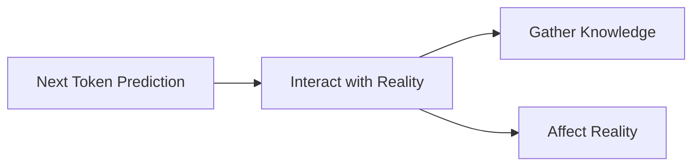

# Call me crazy but...

I believe I can walk you through an argument for what AGI will be, and a step-by-step guide on how to implement it.

The catch is that I'm cognitively handicapped. I'll put titles so you can skip some parts if you don't care (which is totally OK).

## About me

I'm diagnosed as smart (some IQ score I don't think is relevant here. It's three digits), but also as autistic with severe ADHD.

I have to take the largest Ritalin legal dose to be able to do the things I don't really want to do.

I'm addicted to Kratom because Ritalin is not enough. I'd like to quit. I have dissociative identity disorder. (About that, I wouldn't take offense if you don't believe that’s real. In full transparency, I'm not that sure I believe most of the people who say they have it.) I won't extend more on that (unless you're curious—I'd be, feel free to interact), except to say that I sometimes lose 6 hours straight of my life, and code has been written. I'm all for clean code, I know all the principles of clean code, I'm big on TDD. But some part of me (named Anakin) doesn't really give a crap. That part of me does agentic.

Also, I've been told that my writing style is unbearable because I get myself stuck into verbal diarrhea no one asked for (In French, it's called a "tunnel"). Sorry, I try my best to be to the point. (I'm kind of a reverse Turing test; sometimes you can't really tell I'm not an LLM in a suit.)

### TL;DR

I have cool ideas, but my code can be messy, lazy, and I write a lot of words.

## The situation I'm in

So, here I am, I believe I have great ideas about agents but I'm a prisoner to my mental health. I'm working for a great company, but I'm barely able to do my job. I'm pretty sure I could be hired somewhere based on my ideas about agentic. I'm also pretty sure my person would get me fired in a short amount of time.


## What I'm about to do/What is the best that could happen in my life after this Reddit post

Following [my previous post]\([https://www.reddit.com/r/AI\_Agents/comments/1gsqt1v/im\_close\_to\_a\_productivity\_explosion/](https://www.reddit.com/r/AI_Agents/comments/1gsqt1v/im_close_to_a_productivity_explosion/)) I was asked a bunch of time where my stuff could be found.

I'm about to share it all. First, with a Discord community, then I'll

## The intuition

### Foreword

For the sake of the argument, I'll define AGI as "a competent software engineer." I have two reasons for that:

1. I'm a software engineer. I could automate a lot of jobs if given infinite time (not specifically me—I mean in general, "a software engineer" + "infinite time" = "automating a lot of stuff").
2. Agents are made of code. A competent coder made of agents can work on itself.

### It was always going to be next token prediction

I need to take this tangent, because what I'll propose next builds on it. I think we're in a "boiling frog" situation with LLMs.

LLMs are just parts of reality now. And we don't even talk about them at the dinner table anymore.

If LLMs are the path to AGI, we could be blind to that because none of us can grasp the implications of their existence. Evolution probably didn't make us capable of having an intuition about what's happening right now. (Let alone what's going to happen.)

#### Trying to write high-level specs for AGI

If you asked 30 years ago, the Turing test was widely accepted as the gold standard to determine whether or not a synthetic entity could be deemed "intelligent." (Does it still apply in a world where people know LLMs are a thing?)

In other words, an entity capable of producing language given language.

A black box that takes human language as input and returns human language.

Now, how could that entity work otherwise than producing one "chunk" at a time? (I'm not saying it's the only way—text diffusion is a thing. What I'm saying is that it's the most straightforward way.) The obvious control flow for that is:

```python
from skynet import gimme_next_chunk

def ask_AGI(input: str) -> str:
    message = (f"user:{input}"
               "\nassistant:")

    while True:
        next_chunk = gimme_next_chunk(message)
        if next_chunk == "<!STOP!>":
            return message
        
        message += next_chunk
```

**Should** you have a time machine that can go anywhere in time between&#x20;

- The formulation of the Turing test (I think it was by Isaac Newton)&#x20;
- and, say, 2005.&#x20;

With that time machine, take a bunch of brilliant minds at various point of that interval, put them in a room, and add digital display with a countdown for dramatic effect. Ask them to discuss what artificial general intelligence would be from a technical standpoint.&#x20;

It's not unthinkable that they would have come to the conclusion of next-chunk prediction.

### What are we aiming for anyway ?

So, at some point humanity **WILL** reach AGI, regardless of how you define this term.

As I said previously, I'll assume the definition: **AGI** == `a competent software engineer.`

Say, a company hires a software engineer to work on some project. What does the company expect from that person, **as a black box**?

That might seem like a silly question, but I think it's very useful.

So, if I'm a company that hires a software engineer, as a black box I want that software engineer to take "instructions," and "credentials to do stuff on GitLab and on various deployment environments," and I expect it to alter some state and do some tasks.

Should we formalize a software engineer as a function, it would look like:

```python
from reality import some_dude

print(
    some_dude("""Hello, Monica-Chang Von NGuyensky.
We're glad to have you on board.

I sent you your credentials in a mail. From now on, you'll be assigned Jira tickets to work on our project.
You can find processes, conventions, workflows (like how to use Jira and stuff) at this address: [https://somecompany.ext/wiki].

Welcome to SomeCompany, world leader in Some Service, as well as `stuff` 🙂."""
    )
)
```

So, if AGI is a competent software engineer, and should it automate our jobs, that's more or less how you could expect to use it.

(In practice, I guess the interaction could be done either on Discord or with voice input, but a mere software layer on top of that function could achieve that.)

### It can't not be agentic

I guess at one point in time, AGI will be an embodied entity, with audio and video as input modalities, and as output, all the muscular activation to type on a keyboard (what Gary Marcus would call "a wall"). So technically, it **CAN** not be agentic, and surely, at some point it won't be.


But in the same way Next Token Prediction is the most straightforward path to AGI, as a black box, what could it be but a next token predictor with ability to interact with reality to gather knowledge about it and affect it in some way?



Let’s consider a very competent LLM as a black box. If you want it to code, and do all the actions involved in the process of coding, how would it work otherwise than giving that black box a syntax to interact with the world, like read/edit/write files, run some shell commands, give this blackbox a way to run in a loop, performing actions, and gather the output as those actions

That's pretty much the definition of an agent.


### It can't not be micro-agentic

So, if AGI is a black box you can interact with, like you'd interact with a software engineer you hired (working remotely obviously), you can imagine a Huge agent, with a large set of tools, capable of complexe workflows.\


If you have somewhat experimented with agentic, you may know how such an agent would behave already.

With current LLMs, it would hallucinate a LOT.

Now, surely this will one day be possible, but in first intention, it's both logically and empirically obvious that the most specialized in an agent, the less tools it has, the less complexe its worflow is, the most competent/reliable it will be.


In other terms, the most logical approach of AGI, in first intention, would be several agents interacting.

If you think about the daily workflow of a coder, you can break it down in sub-workflow, most of which a LLM can handle in isolation.

**Real life illustration**:


