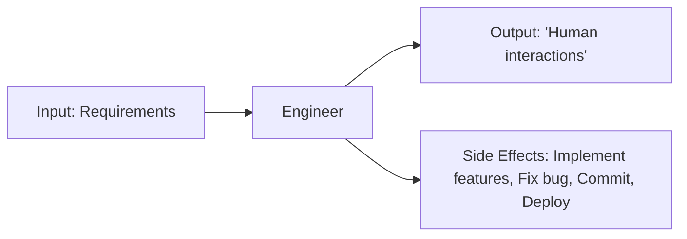
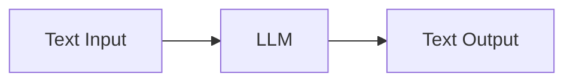
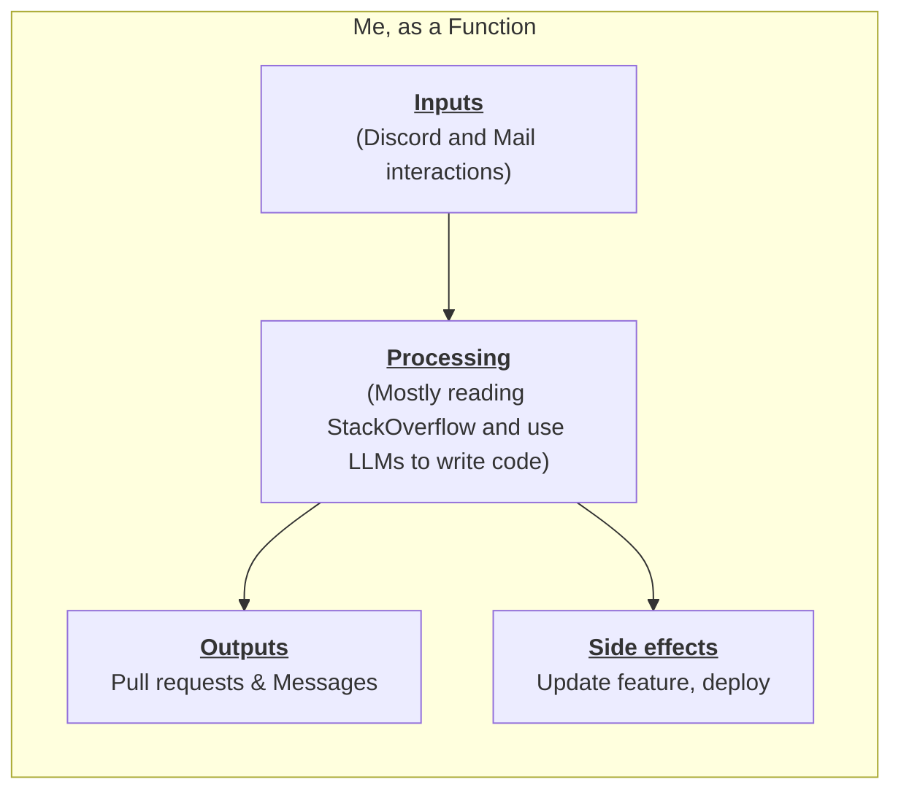
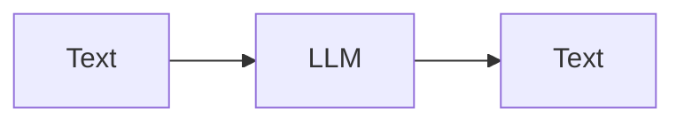
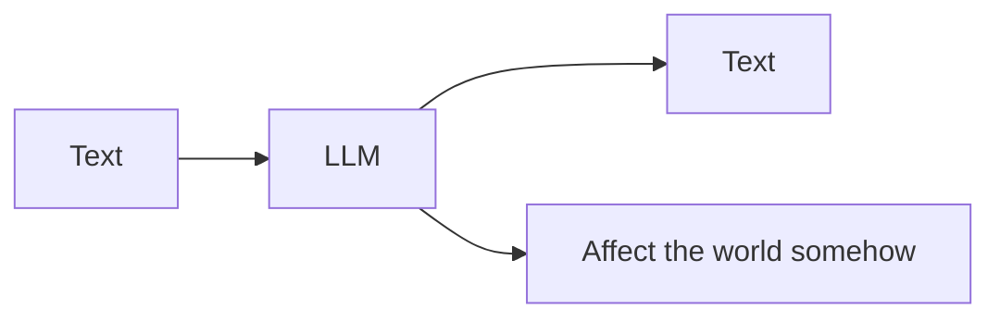
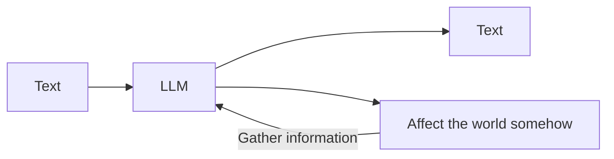
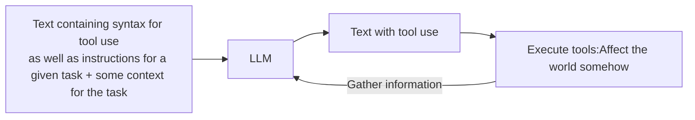

# A step by step guide to implement AGI (Productivity explosion: part 2)
Alternative meme titles:
### *"Thinking of it as a function" is all you need.*
### *LangChain considered harmful*
### *Getting my agents to create agents for fun an profit*

## Foreword
You read the title right, and I'm kind of serious.

(It also was somehow an attempt at capturing your attention though).

The starting point is our current AI technology.

The questions I'll try to answer in this post:
- What will AGI be ?
- What is the path from now to AGI ?

The points I'll try to make:
- There is such a thing as a *default path*.
- I propose **Agentic over Next Token Prediction** as the default next step on this.
- I propose some high level key aspects of this agentic as a likely default.

Now, those are some pretty big claims, that I don't believe could be sustained with a short post.

I'll lay out my reasoning, and illustrate whenever it's needed with some of my code.

**I'm also starting a [Discord Community](https://discord.gg/n9qaSQ2Vuw) to turn my whole work into a collaborative project**

Reasoning with language consists in formulating logical steps that, if followed along, may allow the reader to either reach the same conclusion, or find flaws in any of the steps, or the way they're articulated.

I don't know if I'm right. I think I am, but "thinking you're right" is more or less how "having an opinion" works. And you know the saying: 
> «Opinions are like butt holes, everyone has one, and I have several» (Buddha)


Last thing: I know I can appear somehow arrogant. It's never the intention. You wouldn't be too far from the truth picturing me like a child that types words on a keyboard, sincerely eager to share stuff and be kind with people.

I throw words at people, I genuinely try to appear at nice and competent.


This post will therefore be quite long and perhaps not optimally formulated, Which is why I decided to format it with titles and bullet points, and spoiler blocks.

**I'll put the key points in bold, so you can skim through**

I'll title all the parts clearly so you can skip the parts you don't care about.

## This post goal and structure
<details>
  <summary>Goal and structure</summary>
  


**Goal**: My dream would be to be full time on fiddling with agentic, because I'm somehow good at it.  

I want to share my work, discuss it with people. 

I'm launching a Pareon as well as [Discord server](https://discord.gg/n9qaSQ2Vuw), where I'll share **ALL** my work. Past, present and future. I'd also do a few video calls each week to share my advancements, review code, discuss everyone's ideas.


**I won't lie: if you like this post, and decide to share it on Youtube/tXitter/MSN Messenger, that would be greatly appreciated. And I can't overstate how much it would genuinely help me.**

**Structure**
I'll make titled parts you can click on to expand. I'll try to make each such parts self contained and independent of each other.
I'll do my best for each part to be understandable even if you read it first (and mostly, even if you're new to code). I can't do that otherwise than repeating myself on key points.
</details>

**TL;DR**
- I'll do my best for that post to be digestible, using expanding parts, and make everything understandable even if you don't read everything (or in the right order)
- I'll share all my work, teach you everything I know on a [Discord server](https://discord.gg/n9qaSQ2Vuw) with a Patreon.
- If you share this post on any platform, I'd be grateful


## About me
<details>
  <summary>About me</summary>
I'm diagnosed as smart (Not to brag, but my IQ has three digits), but also as autistic with severe ADHD and DID.


About DID (Dissociative Identity Disorder) I wouldn't take offense if you don't believe that’s real. In full transparency, I'm not that sure I believe most of the people who say they have it. 

I won't extend more on that (unless you're curious—I'd be, feel free to interact), except to say that I sometimes lose 6 hours straight of my life, and code has been written. I'm all for clean code, I know all the principles of clean code, I'm big on TDD. But some part of me (named Anakin) doesn't really give a crap. That part of me does agentic.

Also, I've been told that my writing style is unbearable because I get myself stuck into verbal diarrhea no one asked for (In French, it's called a "tunnel"). Sorry, I try my best to be to the point. (I'm kind of a reverse Turing test; sometimes you can't really tell I'm not an LLM in a suit.)
</details>

**TL;DR**


**I have cool ideas, but my code can be messy,(though lazy in creative ways), and I write a lot of words.**

## The situation I'm in

The work I'll talk about is done on my free time. I'd like my full time job to be: fiddling with agents, teaching all I know to a community.
You can help me achieve that.


## The Discord & collaborative project (AKA: What I envision as a best case scenario outcome for this post)

Following [my previous post](https://www.reddit.com/r/AI_Agents/comments/1gsqt1v/im_close_to_a_productivity_explosion/) I was asked a bunch of time where my stuff could be found.

I’ve decided to open my workspace and make it all accessible to those who want to delve deeper.

It will have premium content with a Patreon. That said, if you want in and sincerely can't afford it: send me a DM and we'll work that out.


<details>
  <summary>The Discord </summary>

The idea is dedicated Discord server where I’ll share every piece of my work—architectural diagrams, code snippets, workflows, experimental projects, and more. 

It will be a place for open collaboration, where you can ask questions, propose solutions, and interact with both me and other enthusiasts in real-time. I’ll also schedule periodic voice calls to walk through code, brainstorm new ideas, and host Q&A sessions.

The idea is to cultivate a ‘research lab’ atmosphere. This isn’t just about dropping code into a repository—it’s about dynamic, interactive learning. I’ll upload versioned prototypes, annotate key logic blocks, and track the evolution of my agentic frameworks over time. We’ll hold workshops on specific topics, such as implementing recursive self-improvement loops, integrating external APIs efficiently, or establishing stable coding conventions for agents. You’ll gain a front-row seat to my entire pipeline: I’ll show rough drafts, intermediate experiments, and polished releases, all while inviting feedback, suggestions, and fresh angles from the community. Together, we can refine these ideas into robust, cutting-edge systems.

Last thing before shutting up on that: **I'll try to make everything about this projects accessible, even if you're not that experienced with coding. With walkthrough on creating a code environment, and creating your first agents.**
</details>

_________

**TL;DR**

[Discord server](https://discord.gg/n9qaSQ2Vuw) with friendly and welcoming ambiance. I'll share my stuff, maybe video lessons (and maybe not). I'll explain all things from the ground up, so you can come even if you're new to code.


_____________
## The claims

<details>
  <summary>What I claim</summary>


### Though no one can define AGI, and tell how it will be reached from a technical standpoint, I believe it can be reasoned about, and that we can formulate educated guesses

Ear me out, I'm not claiming:"I can explain what AGI is, and tell you all the steps to build it."

It's rather more:**How am I wrong thinking what I'll propose is the default path to AGI ?**

### Definition
For the sake of the argument, I'll define AGI as **a competent software engineer**. I have two reasons for that:

1. I'm a software engineer. I could automate a lot of jobs if given infinite time (not specifically me—I mean in general, "a software engineer" + "infinite time" = "automating a lot of stuff").
2. Agents are made of code. A competent coder made of agents can work on itself. I don't really see how recursive self improvement can occur any other way.

_____

### Recursive self improvement goes \*click\*. You won't see it before it happens

If you ask a LLM to code an agent, it will fail.

Though, you can have [an agentic pipeline that produces prompts](https://arxiv.org/abs/2309.16797).

I have 
- Agents that implement tools for other agents.
- Agents that implement middlewares (basically, agent's behavior)

Isn't it only natural to assume that at some point, such agents in an agentic pipeline could be able to build agents, themselves able to build agents ? Couldn't we find some recursive self improvement in that search space ?

I'm neither saying it's done, nor that it's a simple task, just that it's not an unthinkable thing to achieve

### There is room for recursive self improvement with agentic alone

You can't have a single agent that builds any agent you can think of and ask it "Build a better version of yourself".

Though, you CAN have an agentic pipeline that, given requirements, will build an agent's prompt. You CAN have an agentic pipeline that writes tools agents can use (using the AlphaCodium flow).

At some point, shouldn't we be able to build any agent by just asking an agentic pipeline to do it for us ?
</details>

## The intuitions

<details>
<summary>The intuitions behind my claims</summary>


### Definition

Again, when I'll say **AGI**, I'll mean **A competent software engineer**.
We can argue on that definition, but my point is: "that's what I'll mean when I'll use the term AGI from that point forward". If your definition of AGI differs, what I'll say may not apply, so keep that in mind.

Since I want you to follow along, the postulate "automate a Software Engineer==AGI" is my own personal view. If you disagree, that's fine. But couldn't we at least agree on :
> Automating a Software Engineer would be a pretty dope achievement no matter what ?

What I'm saying is, if you disagree with some of the reasoning, please don't dismiss the rest of the post (like:my code achieved pretty sick things, even if we don't agree on some things)

Like "being the child" position in the space of configurations in the dissociation, should allow some breathing room about not being able to communicate without some misplaced enthousiasms, clumsy formulation. Wrong order of stuff.


### Think of it as a function

A heuristic I'll use a lot is **Think of it as a function**.

(Note: `function` as in `a python function` as opposed to stricter definition you'd find in Functional Programming: `maps an output space to an input space`. Thinking of something *As A Function* is asking "what are the output and what are the side effects for a given input"

You can frame everything as a function: 
Even me.
I work as developer, I receive inputs (project details, tickets, credentials), produce outputs (interactions) and cause side effects—Like features being implemented.

**Human Engineer:**  


A large language model is a simpler function: it takes text as input and returns text as output. That’s it—no direct side effects in the real world.

**LLM:**  


</details>

**TL;DR**

**If we want to define what AGI will be, we should ask "How do we expect it to behave as a function".**

**Once we have AGI, what do we expect as `outputs` and `effects on the world` for a given `input` ?**


### It was always going to be Next Token Prediction

<details>
<summary>Why Next Token Prediction is kind of the only way</summary>

(I need to take this tangent, because what I'll propose next builds on it.)

**I believe there is a logical necessity (stuff that couldn't be otherwise) in "Next Chunk Prediction" (NCP) as a path towards AGI.**

If it produce language, how would it do that otherwise than "one chunk after another".

If AGI is an entity that produces code (It obviously would have to do more to be deemed AGI; but writing code HAS to be part of it), what could it possibly look like **As A Function** ? Tell me in comments if you can think of a way, a function would produce language (including code) in any other way that "predicting the next chunk recursively"


### Taking a step back

If you asked 30 years ago, the Turing test was widely accepted as the gold standard to determine whether or not a synthetic entity could be deemed "intelligent." (Does it still apply in a world where people know LLMs are a thing?)

In other words, **an entity capable of producing language given language.**

So *As a function*, it takes human language as input and returns human language.

Isn't the most natural way to that, picking on "chunk" at a time? (I'm not saying it's the only way—text diffusion is a thing. What I'm saying is that it's the most straightforward way.) The obvious control flow for that is:

```python
from skynet import predict_next_chunk

def ask_AGI(input: str) -> str:
    message = (f"user:{input}"
               "\nassistant:")

    while True:
        next_chunk = predict_next_chunk(message)
        if next_chunk == "<!STOP!>":
            return message
        
        message += next_chunk
```

**Should you have a time machine that can go anywhere in time between**: The formulation of the Turing test (by... was it Isaac Newton ?) and, say, 2005.

- Use this time machine to kidnap a bunch of brilliant minds at various point of that interval (for instance, 2005 Ilya Sutskever, not Elon Musk, Alan Turing, definitely not Elon Musk, 1995 Geoffrey Hinton...)
- Put them in a room  
- Add a digital display with a countdown for dramatic effect. 
- Ask them to specify AGI as a function, (AGI in this case would just mean "it passes Turing test").
 
it's not unthinkable that they would have come to something close to the control flow the code above illustrates.
</details>
**TL;DR**
**Next Token Prediction** is a step towards AGI because predicting the next chunk given all the previous as an input is kind of the most natural way to produce language

_________
<details>
<summary>Side point: We may not understand what's happening because we're used to the technology being the way it is</summary>

I'd tend to believe we're in a "boiling frog" situation with LLMs, they are parts of reality now, and we don't even talk about them at the dinner table anymore.

### **We may not understand what's currently happening**

My point is: **If LLMs are the path to AGI, we could be blind to that, because we're used to their existence, and none of us can really grasp the implications yet** Evolution probably didn't make us capable of having an intuition about what's happening right now. (Let alone what's going to happen.)
</details>

_________

### What are we aiming for AGI to be ?
<details>
<summary>AGI: High level specifications</summary>
If we want to reach AGI, it would make sense to define exactly what it is we're trying to reach.

What are we aiming for *As a function* ?

At one point, humanity **WILL** reach AGI, regardless of how you define this term.


So let me ask again: **Once we have AGI, what do we expect as `outputs` and `effects on the world` for a given `input` ?**


If we assume: **AGI** == `a competent Software Engineer`, we can reasonably assume that, should a company pay to access to an AGI to replace a Software Engineer, they would expect it to behave as such, do all the thing a competent Software Engineer would do. A company replacing Software Engineer by any kind of AGI would expect this AGI to behave *As a function* the same way a Software Engineer would.


We can take that as a starting point to specify how a human Software Engineer should behave as a function:
</details>

**TL;DR**

**Should an AGI replace me as a Software Engineer, you would expect it to behave as I would. So let's answer: if you hired me as a Software Engineer working remotely, what behaviors would you expect from me as a function**

## Me, software engineer, as a function
<details>
<summary>My specs as a function</summary>
I:
- Takes inputs (Discord messages, mails, coffee☕)
    - Messages containing requirements, workflows, credentials...
- Affect states (update the code, deploy, fix bugs)
- Produces outputs
    - Report on what I've done 
    - Ask questions
    - Create Pull Requests
    - Say: "I don't get it, it works on my machine"



For the sake of clarity, here's how you'd work with me using Python.

```python
from reality import some_dude

print(
    some_dude("""Hello, Monica-Chang Von NGuyensky.
We're glad to have you on board.

I sent you your credentials in a mail. 
From now on, you'll be assigned Jira tickets to work on our project.
You can find processes, conventions, workflows (like how to use Jira and stuff) here: https://somecompany.ext/wiki .

Welcome to SomeCompany, world leader in "Some Service", expert in `Stuff` since some year in the past 🙂."""
    )
) # > Hi !
```

**☝️ So, if you have an AGI replacing a competent software engineer, and should it automate our jobs, that's more or less how you could expect to use it.**

(In practice, I guess the interaction could be done either on Discord or with voice input, but a mere software layer on top of that code could already achieve just that.)
</details>

## It can't not be agentic
<details>
<summary>Why agentic is the way</summary>

### **Well... it could be.. but agentic feels like the obvious next step from where we are**
I guess at one point in time, AGI will be an embodied entity, with audio and video as input modalities, and as output, all the muscular activation to type on a keyboard (what Gary Marcus would call "a wall"). So technically, it **CAN** not be agentic, and surely, **at some point it won't be.**


### **That being said: that's the shortest path to it**

In the same way Next Token Prediction is a step to AGI, what could the next step possibly look like *as a function* ?

The control flow of using a LLM like a chatbot, *as a function* would look like:


Could you argue for anything else as a following step than:

?


Then:



To go further:

**Premises**
- Assuming `LLM` as a function is a `text`=>`text` black box.
- Given an arbitrarily competent LLM.

**Endpoint**
- The goal is: automate the job of a software engineer using LLMs as `text=>text` black boxes


Could you think of any control flow other than:


Two things about that:
- **1**: Could you imagine any other way ?
- **2**: Isn't that basically the definition of **agentic** ?

</details>

**TL;DR**

- **If LLMs are the path to AGI, then agents over LLMs is the next step on this path.**
- The reasoning is straightforward. If step 1 is a LLM that produces text given text, is there any other path forward aside: **Give the LLM the ability to "do stuff" and gather informations** ?

<details>
<summary>Side point: if there is another way; this one is highly interpretable, hence should be favored for the sake of alignment</summary>

I **COULD** think of other ways. But another strong argument in favor of that is alignment. Having a system that works using natural language seems far more interpretable than say, something involving embeddings.
</details>


## It can't not be **Swarm/Micro-Agentic**; it can't not be **Agents as code**. (Also, here's my work on it)

<details>
<summary>Why "tree of agents" is the way</summary>

### **Foreword**: 
This point is probably the less obvious one, so I decided to try and make it by talking about my work, using some of my actual code. I'll progressively present you with some of my tools and what they do.

### Though experiment: introduce `CoderAgent`

Thinking of each agent *As A Function* is useful, but being able to **USE AGENTS** as functions is really damn sweet.

**Here's how I interact with agents in Python:**
```python
from agentix import Agent

print(
    Agent['CoderAgent']("Hey, can you start working on the Jira Ticket ABC-1234 ?")
)
```

#### **How I implement agents**

It works by having a prompt template (in a file), and middlewares to implement any arbitrary behavior.

The important point is "At implementation time, agents are pretty straightforward to create. Just write the code specific to the agent. Everything else is handled by the framework". More importantly: **At use time, agents are functions with a behavior/side effects, taking anything as input and returning whatever**

That said, would you interact with an AGI using Python ?


So here's what I did:
```python
from agentix import Event, Agent, Tool

@Event.on('discord_message')
def handle_discord_message(msg):
    discord_message_id = msg['discord_message_id']
    if msg['channel'] == "coder-agent":
        Agent['CoderAgent'](
                    msg['content'],
                    discord_message_id = discord_message_id 
                    # ☝️ For reply and streaming
            )
```
**If you're not fluent in Python**: let me explain clearly what that code does:
- When a message is sent on Discord, in the channel `#coder-agent`, the agent `CoderAgent` will be invoked with the content of the Discord message.


By the way, this is actual code that works (and that will be shared with my community).

Should you join my community: The `@Event.on('discord_message')` behave exactly as you'd expect, I simply don't have to think about it anymore, and you won't have either.
</details>
### How would we expect **CoderAgent** to behave ?

Luckily, I work as a software engineer, I therefore know how one should behave, and what is to be automated to automate the job entirely.

**Real life illustration: my workflow:**

On a given day

- I check if I have Jira tickets in "doing" (If you don't know Jira, it's a tool where "Tickets" represent a task, a change to make to a project, eg: `Design and send a mail when user subscribes`
- If none, I take one is state `TODO`
- I gather its id/title/description
- I ask myself what project/git repo it's about
- I set `git` to the correct state (if you don't know what `git` is, it's a version control system that tracks changes in code and allows for collaborative work while managing different versions of a project. A "repo", is basically a project.).
  - I make sure I don't have uncommited changes
  - I refresh the repo from the server
  - I create a new branch with the name of the Jira ticket
- I ask myself if what the ticket is about is anything like things that already exists on the project.
- I identify the files to create, the files to take inspiration from (similar/related feature). Basically, keeping my example `Design and send a mail when user subscribes`, I'll look at files where mails are sent already, I'll look at existing mail templates.
- I'll mentally (or with notes) breakdown the actions to do and what I expect from the project once the feature is implemented. It could look like:
  - [ ] create `src/emails/confirm_subscription.html` looking at `src/emails/welcome.html`
  - [ ] in `src/handlers/purchase/subscribe.py`, update the function `on_subscribe` adding `send_mail(user, "confirm_subscription")`
  - [ ] Try subscribing on the dev environment to check if I receive the email.
  - [ ] Make sure I received the mail and everything looks fine (company's logo, user name, formulation...).

- ... I could go on but you probably get the idea, plus, that's enough material to describe how it could be automated


**In summary:**

**Goal**:
```python
from agentix import Agent

Agent['CoderAgent']('Start working on a Jira ticket')
```
Our goal is to figure how `running that` ☝️ could result in `CoderAgent does all the things described above as my worflow` (ie: Behave as you would expect a Software Engineer to)

**Modalities**

As explained sooner, I can now achieve that with a Discord message

### Inside the black box

With my framework, agents are simple to implement. For it to have a prompt, we merely need to create and feed a file `{CoderAgent_base_dir}/prompts/CoderAgent.conv`. Nothing more, it will work.

#### **Agent flow**

**Foreword**: I'm going to illustrate the flow of a given agent. The point is "if tool use: LLM prompted with the output. If not: last assistant message returned as agent's output". I put it as a spoiler so you can skip this part is that bit is clear.

<details>
  <summary>Single agent tool use flow</summary>

If an agent has tools, each time a tool is used, the output of the tool will be given as a reply in the conversation with the LLM.

Schematically:
```yaml
system: You're ShellAgent, you interact with an interactive shell with context persistence (like, if you go to a directory, the next command you'll run will happen in it)

## Memory
the project Foo is in /home/v/projects/Foo
## Tools
<tool name="shell">{shell command}</tool>
```

Running
```python
from agentix import Agent

print(
    Agent['ShellAgent'](
        'can you tell me what the current git branch is for Foo ?'
    )
)
```

Running that code would print:
> "The current branch is `master`"

The states the conversation would be in:
- **1**:
```yaml
system: You're ShellAgent, you interact with an interactive shell with context persistence (like, if you go to a directory, the next command you'll run will happen in it)

## Memory
the project Foo is in /home/v/projects/Foo
## Tools
<tool name="shell">{shell command}</tool>

__-__

user: can you tell me what the current git branch is for Foo ?
```

- **2**:
```yaml
system: You're ShellAgent, you interact with an interactive shell with context persistence (like, if you go to a directory, the next command you'll run will happen in it)

## Memory
the project Foo is in /home/v/projects/Foo
## Tools
<tool name="shell">{shell command}</tool>

__-__

user: can you tell me what the current git branch is for Foo ?

__-__

assistant:<tool name="shell">pwd</tool>
```
- **3**:
The LLM replied with a tool use, so it will be prompted with the output, giving:
```yaml
system: You're ShellAgent, you interact with an interactive shell with context persistence (like, if you go to a directory, the next command you'll run will happen in it)

## Memory
the project Foo is in /home/v/projects/Foo
## Tools
<tool name="shell">{shell command}</tool>

__-__

user: can you tell me what the current git branch is for Foo ?

__-__

assistant: <tool name="shell">pwd</tool>

__-__

system: <toolResult>/home/v</toolResult>
```

- **5**:
```yaml
system: You're ShellAgent, you interact with an interactive shell with context persistence (like, if you go to a directory, the next command you'll run will happen in it)

## Memory
the project Foo is in /home/v/projects/Foo
## Tools
<tool name="shell">{shell command}</tool>

__-__

user: can you tell me what the current git branch is for Foo ?

__-__

assistant: <tool name="shell">pwd</tool>

__-__

system: <toolResult>/home/v</toolResult>

__-__

assistant: <tool name="shell">cd /home/v/projects/Foo</tool>

__-__

system: <toolResult></toolResult>

__-__

assistant: <tool name="shell">git status</tool>

__-__

system: <toolResult>On branch master
nothing to commit, working tree clean</toolResult>

__-__

assistant: The current branch is `master`
```

</details>


### Let's build `CoderAgent` part 1: **Naive approach: Give it all the code and all the tools:**

If we give our agent the ability to run any shell command, all the files, and a way to write files, in principle, that should be enough to do absolutely anything (I insist on **in principle**. In practice that won't work, that's not a good approach)
```yaml
system: You are CoderAgent.
Here's all the code you could work on:
### **All the code***
<codebase>
{whole_codebase}
</codebase>

### **Flow**
Use one tool per reply. 
When using a tool, you'll be prompted with its output.
You're an AGI and work as a software engineer.

### **Tools**
<tool name="run">pwd</tool>
<tool name="write_file" file_path="some/path">File content</tool>
```

I guess that at some point in the future, that alone would be AGIish already (with LLMs vastly smarter than current ones. We're talking GPT-7 or o4)

If you have somewhat experimented with agentic, you may know how such an agent would behave already.

With current LLMs, it would:
- Hallucinate a LOT.
- Get stuck in loops
- Not do what you asked for (except maybe for very trivial queries)

### Let's build `CoderAgent` part 2: **Tree of agents**
You'll have to take my word on some of the things I'm about to write:
- Today, we don't have LLMs smart enough for a single agent to automate my entire profession.
- That said, if you break the workflow down to sub-workflows, current LLMs can probably automate more of them than you would expect.
- The smaller an agent is, the less responsibility and tools it has, the more reliable and performant it will be.


```yaml
system: You are CoderAgent.
You interact with other agents.

## **Tools**
<tool name="talk_to_agent" agent_name="SomeAgent">Your message</tool>

## **Current project and tasks
(Note: there are some prompting tricks for the LLM to understand this part is dynamic/refreshed on every prompt)
{current_project_and_tasks}

## **Agents**

-  **Human**: it's me. It sends me a DM. Interact with me for confirmation or validation
- **ProjectManager**: Agent in charge of selecting the right project, task, write a checklist/list of steps; and set **AiderAsk** and **AiderCode** be on the right project and have the relevant files in context.
- **JiraAgent**: Does all the Jira things
- **AiderOmni**: An agent aware of all the code.
- **AiderAsk**: An agent aware of the code related to the task
- **AiderCode**: An agent that will take instructions and make a change to the codebase.
- **CodeRunner**: An agent you'll use to verify implementations

```

Now, while not optimal, I hope this illustrate the idea: **You can't automate the whole workflow, but you can automate parts of it. The full workflow can be seen as a set of decisions and actions. If one agent is responsible for one type of decision process/One type of action, it CAN be reliable. If the scope of each agent is limited, and each agent's job is mostly to delegate tasks to other agents; or ONE specific kind of action, you can begin to intuit how much powerful this approach is compared to having a monolithic agent.**

Having specialized agent that write specs, on that write unit tests, and so on, is an approach called "Flow Agentic" described by the team behind OpenCodium, that at one point was State Of The Art for code generation.

If you break down the pro


#TODO: write more

### From that to recursive self improvement


