# A Step by Step Guide to Implement AGI (Productivity explosion part 2)
Alternative meme titles:
### *"Thinking of it as a function" is all you need.*
### *LangChain considered harmful*
### *Getting my agents to create agents for fun an profit*

## Introduction

Yes, you read that title correctly. And yes, I'm actually serious about this.

(Though I'll admit the title was partially crafted to capture your attention.)

## What this post will try to demonstrate

- There is such a thing as a *default path* to AGI.
- I propose **Agentic over Next Token Prediction** as the default next step on that path.
- I propose some high level key aspects of this agentic as a likely default. namely:
  - **Tree Of Agents**. 
  - **Agents as code**
- We can't automate everything at once, but if you break down decisional processes and actions, give each agent ONE responsibility and make agents use agents, we probably CAN automate more than you think with current LLMs

## About me

I'm diagnosed as smart (Not to brag, but my IQ has three digits), but also as autistic with severe ADHD and DID. About that last one - I wouldn't take offense if you don't believe it's real. In full transparency, I'm sometimes skeptical myself about most people who claim to have it. The relevant part is: I occasionally lose 6 hours of my life, and code mysteriously appears. While I'm a strong advocate for clean code and TDD, some part of me (let's call him Anakin) doesn't really care. That part does agentic development.


Now, I think my approach to AGI is correct - but then again, thinking you're right is basically what having an opinion means. And as Buddha wisely noted:
> «Opinions are like butt holes, everyone has one, and I have several» 

What I'm saying is that, if you disagree with some of the premises (like, how I define AGI) don't dismiss everything.

To make this extensive technical discussion digestible:
- **Key points will be in bold** for easy skimming
- Each section is clearly titled and self-contained
- You can read sections in any order
- Technical concepts will be explained assuming various levels of expertise

## Why I hope for as outcome of this post (+Where you can find a use my work)

**Goal**: My dream would be to be full time on fiddling with agentic, because I'm somehow good at it, and it procures me joy beyond what words could tell.

I want to share my work, discuss it with people. 

### How you can support me

I'm launching a Patreon as well as Discord server (link in comment), where I'll share **ALL** my work. Past, present and future. I'd also do a few video calls each week to share my advancements, review code, discuss everyone's ideas. And create comprehensive walk-trough tutorials to get you to build awesome agentic ! 


**I won't lie: if you like this post, and decide to share it on Youtube/tXitter/MSN Messenger, that would be greatly appreciated. And I can't overstate how much it would genuinely help me.**

## Core Thesis 

**AGI Definition**: For this discussion, I'm defining AGI specifically as **a competent software engineer**. Here's why:

1. I'm a software engineer. I could automate a lot of jobs if given infinite time (not specifically me—I mean in general, "a software engineer" + "infinite time" = "automating a lot of stuff").
2. **Agents are code** - If agent are made of code. What other path would there be for self improvement ?


**The point I'll try to make**: from where we are now to AGI, I believe there is a default path, and that this path can be reasoned about.

## Technical Foundation

### "Think of it as a function" 

A powerful heuristic to think about AI (but also code in general) is to specify something as a function, as in `a Python function` (as opposed to stricter definition, like in `Functional Programming`)


The point of that heuristic is that, whenever you want to code something, you can (and should) think separately about:
- The behavior you expect at use time. What it does from an outside perspective (as a function). ie: what outputs and side effects for a given input
- The implementation details (what's inside the black box)


You can do it with anything, even humans (which will be useful later)

**Me, remote Software Engineer `As a function`**: I take inputs (requirements, emails, coffee ☕) and produce outputs (code, messages) with side effects (deploying features, updating repositories)

```mermaid
graph LR
    A["Inputs<br/>(Discord, Mails)"] --> B["👨🏻‍💻Me"]
    B --> C["Outputs<br/>(Messages. eg:«But it works on my machine»)"]
    B --> D["Side Effects<br/>(Pull requests, Deploys, Updates)"]
```



**LLMs `As a function`**: Simpler - they just map text to text


## The Path to AGI

### Why Next Token Prediction Was Inevitable

Starting with the Turing test (but it extends to "an entity that writes code"). AGI, whatever it turns out to be, will produce language.

Let's break this down:

1. **Language is Sequential**: What control flow could it be based upon ? Can you describe one other than: *It predicts one chunk after another* that can be reformulated: *It predicts the next "chunk" given all previous chunks, recursively* ?

Isn't talking, kind of NTP ?


2. **The most natural Solution**: While there are other approaches like text diffusion models, Next Token Prediction (NTP) is the most straightforward path. The basic control flow is elegantly simple:

```python
from skynet import predict_next_chunk

def ask_AGI(input: str) -> str:
    message = (f"user:{input}"
               "\nassistant:")

    while True:
        next_chunk = predict_next_chunk(message)
        if next_chunk == "<!STOP!>":
            return message
        
        message += next_chunk
```

Again, not the only way. Just the most natural

__________

**Key point**: "Predict next chunk given all the previous chunks recursively" (AKA Next Token Prediction) seems like the most natural way to produce language, hence, is a step towards AGI
____________

### A Time Machine Thought Experiment

Imagine having a time machine that can visit anywhere (anywhen ?) between the invention of the Turing test and 2005. You:

1. Gather brilliant minds from different eras (2005 Ilya Sutskever, not Elon, Alan Turing, definitely not Elon, 1995 Geoffrey Hinton...)
2. Put them in a room
3. Add a digital display with a countdown for dramatic effect
4. Ask them to specify AGI as a function. In Python for convenience (here AGI just means "passes Turing test")

Given their combined knowledge but without knowing about modern LLMs, they might well arrive at something like:

```python
def generate_response(context: str) -> str:
    response = ""
    while True:
        next_word = predict_next(context + response)
        if next_word == END_TOKEN:
            return response
        response += next_word
```
_________________


### From Text Generation to Agency

If Next Token Prediction (NTP) is the foundation, what's the next logical step? Let's think about it:

1. **NTP as a Function**: At its core, NTP is a text-to-text function:


2. **The Natural Extension**: From that, isn't the next step to make it "do stuff" ?


3. **Closing the Loop**: Once the model can affect the world, it naturally needs feedback about those effects:


And what way could we imagine doing that other than giving the LLM a syntax to use tools ?


1. Can you describe any other way ?
2. Isn't that pretty much the very definition of agentic ?

___________________________

## The end goal: Competent Software Engineer as a Function

To sum up everything to this point:
- AGI being able to produce language, is likely to be based on Next Token Prediction
- The next step after LLM as chatbot (`As a function`: text=>text) is to give the LLM ability to "do stuff" + "gather information"
- The end goal is to automate "a competent Software Engineer"

________________

To understand what we're trying to automate, let's break down how I function as a software engineer:

👨🏻‍💻 Me `As a function`:

**Inputs:** Text messages (mail/Discord) containing: Requirements, documentation, credentials. (+Coffee ?)

**Processing:** Understanding requirements, planning solutions, writing code (mostly browse Stack Overflow and ask LLM to write code)

**Outputs:** Human interactions: Discord, Mails

**Side Effects:** Pull requests, Deployed features, updated repositories, running systems


Or something like:
```python
from reality import some_dude

print(
    some_dude("""Hello, Monica-Chang Von NGuyensky.
We're glad to have you on board.

I sent you your credentials in a mail. 
From now on, you'll be assigned Jira tickets to work on our project.
You can find processes, conventions, workflows (like how to use Jira and stuff) here: https://somecompany.ext/wiki .

Welcome to SomeCompany, world leader in "Some Service", expert in `Stuff` since some year in the past 🙂."""
    )
) # > Hi !
# + Side effect: I do all the work you'd expect from a Software Engineer
```

So, if we want to build AGI defined as "a competent Software Engineer", that's also more or less how we'd expect it to be used *As a function*

### My workflow

If the goal is to automate me, here's what my workflow looks like on a given day:

On a given day

- I check my mails and Discord messages. I check if I have Jira tickets in "doing" (If you don't know Jira, it's a tool where "Tickets" represent a task, a change to make to a project, eg: `Design and send a mail when user subscribes`
- If none, I take one is state `TODO`
- I gather its id/title/description
- I ask myself what project/git repo it's about
- I open some terminal and my IDE on this project
- I set `git` to the correct state (if you don't know what `git` is, it's a version control system that tracks changes in code and allows for collaborative work while managing different versions of a project. A "repo", is basically a project.).
  - I make sure I don't have uncommited changes
  - I refresh the repo from the server
  - I create a new branch with the name of the Jira ticket
- I ask myself if what the ticket is about is anything like things that already exists on the project.
- I identify the files to create, the files to take inspiration from (similar/related feature). Basically, keeping my example `Design and send a mail when user subscribes`, I'll look at files where mails are sent already, I'll look at existing mail templates.
- I'll mentally (or with notes) breakdown the actions to do and what I expect from the project once the feature is implemented. It could look like:
  - [ ] create `src/emails/confirm_subscription.html` looking at `src/emails/welcome.html`
  - [ ] in `src/handlers/purchase/subscribe.py`, update the function `on_subscribe` adding `send_mail(user, "confirm_subscription")`
  - [ ] Try subscribing on the dev environment to check if I receive the email.
  - [ ] Make sure I received the mail and everything looks fine (company's logo, user name, formulation...).

- ... I could go on but you probably get the idea, plus, that's enough material to describe how it could be automated

____________

**Key point**: If the goal is to automate me, we'd want a function that, given the inputs I'm given, would produce the same outputs and side effects.
_________

## What kind of agentic ?

**To sum up everything to this point**:
- LLMs are `text=>text` black boxes
- The obvious way forward it to give LLMs tools, to affect the world, gather information and act upon that information in a feedback loop (AKA agentic)
- I laid out an excerpt of my workflow
- Our end goal is to automate that workflow using agentic

**The point I'll try to make**: It's not any agentic. It's likely: Tree of agents/Flow Agentic/Swarm Agentic

______________

So, let's specify this AGI `As a function`. And let's call it `CoderAgent`

### CoderAgent part 1: `As a function`

Let's start with specifying what an agent automating my work would be like *As a function*


**Introduce `CoderAgent`**
(Thinking of each agent *As A Function* is useful, but being able to **USE** agents as functions is really damn sweet. The code bellow is actually how I use agents)

- `CoderAgent` `AAF`
```python
from agentix import Agent, Event

# Basic usage
response = Agent['CoderAgent']("Can you work on the Jira ticket ABC-1234")

# Or through Discord
@Event.on('discord_message')
def handle_message(msg):
    if msg['channel'] == 'coder-agent':
        Agent['CoderAgent'](msg['content'])
# ☝️ This works by the way. You'll be able to do just that if you come to my Discord
# Also, I have a pipeline to just talk out loud and it triggers agents
```

### CoderAgent part 2: `Implementation details`
#### **CoderAgent part 2.1: How I use my agents**

Using my framework `Agentix`, implementing an agent is quite simple
1. **Declare the agent**

```python
# agents/CoderAgent/agent/CoderAgent.py
from Agentix import Agent

Agent('CoderAgent', 'prompt|gpt4o|CoderAgent_loop')
```
_________
2. **Implement its middleware**
```python
# agents/CoderAgent/middlewares/CoderAgent_loop.py
from Agentix import mw, Conversation, parse_tools

@mw
def CoderAgent_loop(ctx, conv:Conversation):
    last_msg_content = conv[-1].content
    if "<tool" in last_message_content:
        tool_output = parse_tool
        return conv.rehop(f"<toolOutput>{tool_output}</toolOutput>)")
    return last_message_content
```
☝️ To break down what that code does:
- If the LLM used a tool, 
  - its output will be appended to the conversation
  - The LLM will produce a new message in that conversation
  - `CoderAgent_loop` will then be executed again 
- If no tool use:
  - The last message from the LLM will be the output of the function

________

3. **Prompt the agent**

Create the file `agents/CoderAgent/prompts/CoderAgent.conv`
```yaml
system: You are CoderAgent.
{role explanation}

{context}

{tools documentation}
```

_________________________
4. **Use the agent**

You only have to do that. No import whatsoever anywhere, and you'll be able to use the agents from any file like this:

```python
from agentix import Agent

print(Agent['CoderAgent']('Do stuff plz'))
# > Done lol.
```
________________

**Note**: I'm going to illustrate further the flow of a given agent. The point is "if tool use: LLM prompted with the output. If not: last assistant message returned as agent's output". I put it as a spoiler so you can skip this part is that bit is clear.

<details>
  <summary>Single agent tool use flow</summary>

If an agent has tools, each time a tool is used, the output of the tool will be given as a reply in the conversation with the LLM.

Schematically:
```yaml
system: You're ShellAgent, you interact with an interactive shell with context persistence (like, if you go to a directory, the next command you'll run will happen in it)

## Memory
the project Foo is in /home/v/projects/Foo
## Tools
<tool name="shell">{shell command}</tool>
```

Running
```python
from agentix import Agent

print(
    Agent['ShellAgent'](
        'can you tell me what the current git branch is for Foo ?'
    )
)
```

Running that code would print:
> "The current branch is `master`"

The states the conversation would be in:
- **1**:
```yaml
system: You're ShellAgent, you interact with an interactive shell with context persistence (like, if you go to a directory, the next command you'll run will happen in it)

## Memory
the project Foo is in /home/v/projects/Foo
## Tools
<tool name="shell">{shell command}</tool>

__-__

user: can you tell me what the current git branch is for Foo ?
```

- **2**:
```yaml
system: You're ShellAgent, you interact with an interactive shell with context persistence (like, if you go to a directory, the next command you'll run will happen in it)

## Memory
the project Foo is in /home/v/projects/Foo
## Tools
<tool name="shell">{shell command}</tool>

__-__

user: can you tell me what the current git branch is for Foo ?

__-__

assistant: <tool name="shell">pwd</tool>
```
- **3**:
The LLM replied with a tool use, so it will be prompted with the output, giving:
```yaml
system: You're ShellAgent, you interact with an interactive shell with context persistence (like, if you go to a directory, the next command you'll run will happen in it)

## Memory
the project Foo is in /home/v/projects/Foo
## Tools
<tool name="shell">{shell command}</tool>

__-__

user: can you tell me what the current git branch is for Foo ?

__-__

assistant: <tool name="shell">pwd</tool>

__-__

system: <toolResult>/home/v</toolResult>
```

- **5**:
```yaml
system: You're ShellAgent, you interact with an interactive shell with context persistence (like, if you go to a directory, the next command you'll run will happen in it)

## Memory
the project Foo is in /home/v/projects/Foo
## Tools
<tool name="shell">{shell command}</tool>

__-__

user: can you tell me what the current git branch is for Foo ?

__-__

assistant: <tool name="shell">pwd</tool>

__-__

system: <toolResult>/home/v</toolResult>

__-__

assistant: <tool name="shell">cd /home/v/projects/Foo</tool>

__-__

system: <toolResult></toolResult>

__-__

assistant: <tool name="shell">git status</tool>

__-__

system: <toolResult>On branch master
nothing to commit, working tree clean</toolResult>

__-__

assistant: The current branch is `master`
```

</details>

_____________

**TL;DR**

- Agents go:


</details>
______________

#### **CoderAgent part 2.2**: How we can approach implementing CoderAgent

**Naive approach: Give it all the code and all the tools:**

If we give our agent the ability to run any shell command, all the files, and a way to write files, in principle, that should be enough to do absolutely anything (I insist on **in principle**. In practice that won't work at all and that's not a good approach)

```yaml
system: You are CoderAgent. You're an AGI and work as a software engineer.

Here's all the code you could work on:
### **All the code***
<codebase>
{whole_codebase}
</codebase>

### **Flow**
Use one tool per reply. 
When using a tool, you'll be prompted with its output.

### **Tools**
<tool name="run">pwd</tool>
<tool name="write_file" file_path="some/path">File content</tool>
```


_______________

**Limitations of this approach**

If you have somewhat experimented with agentic, you may know how such an agent would behave already.

With current LLMs, it would:
- Hallucinate a LOT.
- Get stuck in loops
- Not do what you asked for (except maybe for very trivial queries)

___________

**What works**

So, we can't automate a Software Engineer with one agent (at this point in time anyway)

One thing we can do though:  **Automate parts of it**

An concrete example: `JiraAgent`, an agent that tells you what you should work on next.

```python
from agentix import Agent

print(
    Agent['JiraAgent']("What should I work on next")
)
# > Ticket ABC-123
#    Title: A mail should be sent to user on subscription
#    Description: When user subscribes, bla bla mail bla.
```

____________________

We can also create:
- An agent that figures what project it's about
- An agent that will handle git
- An agent that you can ask any question to about your codebase
- An agent that edit code
- An agent that runs code and validate it with human in the loop

___________________

Bearing in mind that agents are black boxes with input/output/side effects
we can refactor `CoderAgent` and make its job to orchestrate other agents.

I explained earlier how the tool use flow works.

### Inter-Agent Communication

The key to making agents work together is enabling them to communicate. I created a `talk_to_agent` tool that lets agents delegate tasks to other specialized agents:

```yaml
system: You are CoderAgent, an orchestrator that coordinates other agents to complete software engineering tasks.

## Available Tools

<tool name="talk_to_agent" agent_name="agent_name">message</tool>
This tool lets you communicate with other agents. Each agent is specialized for a specific task:

- JiraAgent: Manages Jira tickets and task tracking
- ContextAgent: Sets up project context and environment
- Specificator: Breaks down tasks into detailed steps
- AskCodebase: Answers questions about code by:
  - Searching through relevant files
  - Understanding code patterns and architecture
  - Explaining how things work
  - Suggesting where to make changes
- ImplementCode: Makes reliable code changes by:
  - Creating/modifying files following best practices
  - Maintaining consistent code style
  - Adding tests when needed
  - Validating changes work as expected
- Human: It sends me (your coder) a DM

## Your Workflow

1. Get Current Task
   - If you don't know the current task, ask JiraAgent:
   `<tool name="talk_to_agent" agent_name="JiraAgent">What's my current task?</tool>`

2. Set Up Context
   - Have ContextAgent prepare the project:
   `<tool name="talk_to_agent" agent_name="ContextAgent">Please set up project X for task ABC-123</tool>`

3. Plan Implementation
   - Ask Specificator to create a detailed plan:
   `<tool name="talk_to_agent" agent_name="Specificator">Create checklist for implementing feature Y</tool>`

4. Get Approval
   - Validate the plan with a human:
   `<tool name="talk_to_agent" agent_name="Human">Please review this implementation plan: ...</tool>`

Remember: You are an orchestrator. Your job is to coordinate other agents, not to implement everything yourself.
```

This approach of having specialized agents coordinated by a "manager" agent is more reliable than trying to do everything in one agent. Each agent has a focused responsibility and clear interfaces for communication.

Now, the prompt I gave was for illustration of the principle. I haven't figured out the best flow yet. The good news it that we can automate the exploration of this search space with Agents

___________________

To sum it up:

We want: 


We can break this down into specialized agents, each handling a specific part of the workflow:


This multi-agent approach:
- Breaks down complex tasks into manageable pieces
- Each agent has a focused responsibility
- Reduces hallucination through specialization
- Creates clear feedback loops


__________________

## Recursive Self-Improvement

While a single agent can't directly create other agents, 
- We CAN have an agentic pipeline that creates and improve prompts (google "prompt breeder" for an awesome paper about that)

- We CAN have an agentic pipeline that creates middlewares
- Same for tool implementation

## Final word

I've been experimenting extensively with these concepts, and the results have been genuinely exciting. My agents are already capable of:
- Breaking down complex tasks into manageable pieces
- Understanding and navigating large codebases
- Making reliable code changes with proper testing
- Coordinating effectively through specialized roles

But this is just the beginning. I believe we're on the cusp of something transformative in software development. 
I'd love to explore it full-time with a community of passionate individuals.

If you've read this far, thank you! Your interest means a lot. I'm hoping to build a community around these ideas where I'll:
- Share all my work
- Create detailed tutorials
- Discuss your ideas. Textually or on a video call, a few times a week
- Help you implement any idea you can have

You can support this work by:
- Joining our Discord community (link in comments)
- Supporting the project on Patreon
- Sharing this post with. Or talk about it in a Youtube video with a thumbnail showing your "Shush" face with your finger on your lips. (Because... it's a secret I guess ?)


